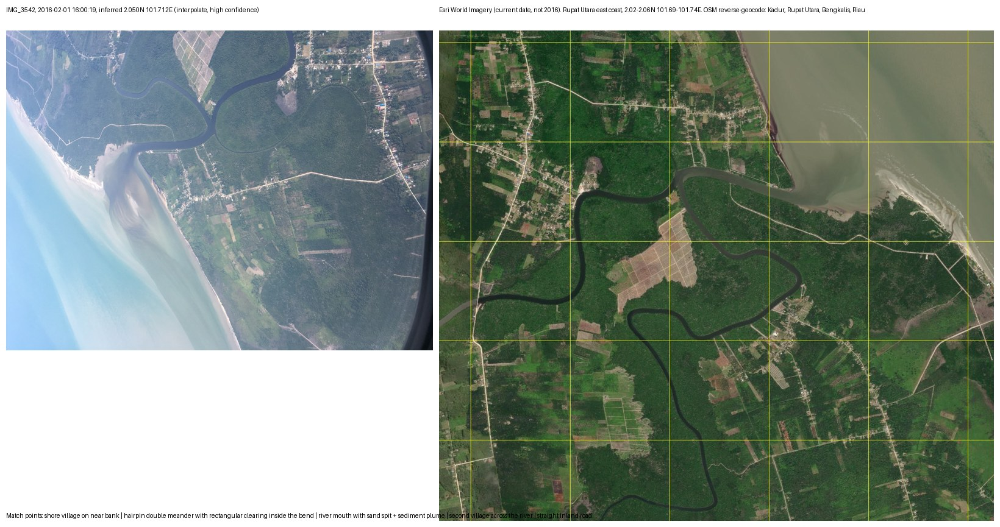

# photo-geo

Puts a position on photos that have none, using the geotagged photos around them. Built in one afternoon on a Mac Photos library of 26,308 photos, by an operator with no GIS background, to answer one question: what were my plane-window photos pointing at?

The answer to that question was small. Two things found on the way are the reason this repository exists.

## Finding 1 — Photos stamps untagged shots with a guessed time zone, and the guess contradicts the GPS on the same flight

Photos stores every capture with a time-zone offset. For a geotagged photo the offset comes from the GPS fix. For an untagged photo it is a guess, and on the 2016-02-01 Bandung→Kuala Lumpur leg the guess was +08:00 while the geotagged frames taken thirteen seconds later on the same aircraft carried +07:00. Comparing the two in UTC moves the untagged frame one hour along the flight path, roughly 850 km, and drops it in the sea off Lampung. Comparing them on the camera wall clock, offset stripped, puts it thirteen seconds before its neighbour, over the east coast of Pulau Rupat, Riau. Satellite imagery confirms the second placement to within the village (see “Validation”).

Rule the tool follows: **compare timestamps on the camera wall clock, never in UTC**, whenever one side of the comparison has no GPS. The camera clock is the one quantity both photos share.

## Finding 2 — A received image geotagged with the recipient's location is a false fix, so the tool refuses to write it

Of 4,054 untagged photos in the library, 3,680 have no camera EXIF at all. They are WhatsApp, WeChat, LINE and Telegram receipts, screenshots and saved images. Their timestamp is the moment they arrived on the phone. Every mainstream geotagging tool will happily stamp them with wherever the phone was at that moment, and from then on the file carries a location that has nothing to do with the picture.

The tool computes those positions (they are useful for “where was I when this arrived”) and shows them in a hidden KML folder, but **never writes GPS into a file that has no camera EXIF**. Provenance is written alongside every fix it does make, so an estimate can never be mistaken for a measurement.

## What it writes

Into a copy of each camera-captured file, via exiftool:

- `GPSLatitude` / `GPSLongitude` — the inferred position
- `GPSProcessingMethod = INFERRED:<method>` — visible in any EXIF viewer
- an XMP namespace `photogeo` carrying `GPSInferred`, `InferenceMethod`, `Confidence`, `AnchorBefore`, `AnchorAfter`, `Note`, `InferredAt`

The library itself is never modified.

## Methods, in the order tried

| method | when | confidence |
|---|---|---|
| `interpolate` | geotagged anchors on both sides, nearest within 15 min; spherical interpolation | high |
| `dead_reckon` | one anchor within 15 min; speed and heading derived from that anchor and its same-side neighbour | medium |
| `nearest_anchor` | one anchor within 15 min, no usable velocity | medium |
| `flight_model` | no anchor within 15 min, same-day anchors more than 300 km apart; great circle, back-calculated from the arrival anchor at 850 km/h with a 20-minute landing allowance | low |
| `interpolate_wide` | same-day anchors both sides, beyond 15 min, short separation | low |
| `nearest_anchor_day` | one same-day anchor only | very low |

An implied ground speed above 1,000 km/h between anchors demotes the fix to low: one of the anchors is lying.

## Validation

IMG_3542, 2016-02-01 16:00:19, untagged, iPhone 6s. Inferred 2.050N 101.712E, method `interpolate`, confidence high. Compared against Esri World Imagery of Rupat Utara's east coast: the hairpin double meander with a rectangular clearing inside the bend, the river mouth with its sand spit and sediment plume, the shore village on the near bank, the second village across the river and the straight inland road all line up. OpenStreetMap reverse-geocodes the mouth to Kadur, Rupat Utara, Bengkalis, Riau. The aircraft was directly over the village.



*Left: the frame, rotated relative to north. Right: current Esri World Imagery, 2.02–2.06N 101.69–101.74E. Match the river loop and the mouth.*

The twenty `flight_model` frames over the Pacific south of Japan remain unverified and are labelled low. That is the point of the label.

## Running it

Requires macOS with the Photos library local, `osxphotos` (`uv tool install osxphotos`), `exiftool` (`brew install exiftool`), Python 3 with Pillow.

```bash
osxphotos query --json --only-photos --not-shared > all.json
python3 infer.py                      # → inferred.json, nofix.json
./export_batch.sh                     # pulls originals from iCloud via Photos' own AppleScript export
python3 build_map.py ~/review/photo-geo   # → inferred.kml, inferred.geojson (thumbnails from <outdir>/thumbs)
```

The exiftool write is the loop in `write_tags.py` using `photogeo.config`. `osxphotos export --download-missing` was not used: it requires PhotoKit authorisation that a non-interactive shell cannot obtain, while `tell application "Photos" to export … with using originals` works and downloads iCloud-optimised originals on demand.

## What it found in one library

| | |
|---|---|
| photos | 26,308 |
| untagged with a capture time | 4,054 |
| of those, real camera captures | 374 |
| placed | 324 (81 high, 9 medium, 137 low, 97 very low) |
| labelled “Porthole” by Photos | 26 |
| porthole frames containing land | 4, one place: Kadur, Rupat Utara |

Everything else through the window was wing, cloud deck and sun on a scratched pane.

## Licence

MIT. Built by Technicity Sdn Bhd, Kuala Lumpur.

## `footsteps` — a day-by-day record of the whole library

```bash
osxphotos query --json --not-shared > all.json      # every item, photos and videos, no date filter
python3 footsteps.py                                 # → ~/review/photo-geo/footsteps/
python3 footsteps.py --no-vision                     # skip the Claude content labels
```

Record only: no interpretation, no adjectives. Runs `infer.py` if `inferred.json` is missing or stale, then:

- **Days** — one record per calendar day (local time) with items: counts, positions split into clusters more than 30 km apart, persons, albums, keywords, titles. EXIF positions win; inferred positions are used only on days with no EXIF fix at all, and keep their `inferred` flag.
- **Stays** — consecutive photo-days whose last position is within 30 km of the running stay = one stay; a photo-less gap longer than 7 days ends the stay and its nights are `nights_unplaced`. Place names from Apple's place fields when present, else offline `reverse_geocoder`; each names its provenance.
- **Flights** — the repo's great-circle model: consecutive position clusters more than 300 km apart. Same-day legs are `flight_model_same_day`; legs across a photo-less gap are `great_circle_between_days` with the origin's last-seen and the destination's first-seen times.
- **Content labels** — up to 6 photos per day (favourites, then non-screenshots, spread across the day) sent to Claude vision for 1–3 plain nouns each. Cached by uuid in `labels-cache.json`; processed newest year first; outputs rewritten after each year so a partial run is usable. Skipped, with a note, when no Anthropic credentials are available.

Outputs: `journal.md` (index) + `journal-YYYY.md`, `days.csv`, `stays.csv`, `flights.csv`, `months.csv` (one row per month across the full span, zero rows kept; `nights_away_from_KL` = nights inside a stay centred more than 30 km from Kuala Lumpur city centre; `nights_unplaced` = nights between two stays in different places), `map.html` (stays sized by nights, flight legs, year slider). Plain `year` column everywhere. The library is never written to.
